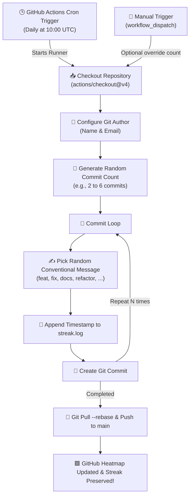

<div align="center">

# 🌿 My Green Graph

### **Automated GitHub Activity & Contribution Streak Keeper**

[](https://github.com/MahmoudEsawi/my-green-graph/actions/workflows/streak.yml)
[](https://conventionalcommits.org)
[](LICENSE)
[](https://github.com/MahmoudEsawi)
[](https://github.com/MahmoudEsawi/my-green-graph)
[](https://github.com/features/actions)

<p align="center">
  <b>A lightweight, zero-maintenance GitHub Actions automation engine designed to keep your GitHub contribution heatmap consistently active with realistic, conventional commits.</b>
</p>

[Overview](#-what-is-this-repository) •
[Features](#-features) •
[How It Works](#-how-it-works) •
[Quick Setup](#-quick-setup-guide) •
[Configuration](#%EF%B8%8F-configuration--customization) •
[Repo Metadata](#-repository-metadata--topics) •
[License](#-license)

---

</div>

## 📖 What is this Repository?

**`my-green-graph`** is an automated **GitHub Activity & Streak Keeper**. 

GitHub tracks your daily developer activity through the famous **"Green Contribution Graph"**. Days without pushed commits leave blank gaps in your activity history. This repository solves that by using **GitHub Actions (Cron Scheduled CI/CD workflows)** to automatically make regular, realistic commits every day into this repository—ensuring your streak stays alive and your contribution graph reflects ongoing daily activity.

### 💡 Why Use It?
- 保持 **Unbroken GitHub Streaks**: Keep your activity streak counter growing continuously without manual daily intervention.
- 🕒 **100% Serverless & Free**: Powered entirely by GitHub Actions runners (0 external servers or paid hosting needed).
- 🎯 **Realistic Git History**: Dispatches conventional commits (`feat`, `fix`, `docs`, `refactor`, `perf`, `ci`, `chore`) with realistic commit volume variance (2–6 commits/day).
- 🛡️ **Zero Impact on Production Projects**: Commits are strictly isolated to this dedicated repository (`streak.log`), keeping your real production repositories clean.

---

## ✨ Features

- ⏰ **Scheduled Autonomous Triggers**: Runs automatically every day at `10:00 UTC` (or whatever schedule you choose) via GitHub Actions cron.
- 🎲 **Stochastic Commit Volume**: Randomizes commit count between **2 and 6 commits daily** to emulate human workflow patterns instead of static rigid counts.
- ✍️ **Conventional Commits Standard**: Employs industry-standard semantic messages (`feat: ...`, `fix: ...`, `refactor: ...`, `perf: ...`, `docs: ...`).
- 🔘 **Manual Workflow Dispatch**: Trigger instant streak updates on-demand anytime with an optional manual commit count override via GitHub UI.
- 📊 **Rich Run Summaries**: Generates detailed Markdown tables in GitHub Actions step summaries showing commit counts, messages, and timestamps.
- 🔄 **Safe Concurrency & Auto-Rebase**: Built-in `git pull --rebase` prevents push conflicts and handles branch sync automatically.
- 🔐 **Privacy & Identity Ready**: Supports repository secrets/variables (`GIT_USER_NAME`, `GIT_USER_EMAIL`) or inline configuration.

---

## ⚙️ How It Works



---

## 🚀 Quick Setup Guide

Get your automated streak keeper running in 4 easy steps:

### 1. Fork or Clone this Repository
Fork this repository to your GitHub account or clone it directly:
```bash
git clone https://github.com/MahmoudEsawi/my-green-graph.git
cd my-green-graph
```

### 2. Enable GitHub Actions Workflow Permissions
GitHub Actions needs permission to push commits to your repository:
1. Navigate to **Settings** > **Actions** > **General** in your repository.
2. Scroll down to **Workflow permissions**.
3. Select **Read and write permissions**.
4. Click **Save**.

```
Repository Settings
 └── Actions
      └── General
           └── Workflow permissions
                └── 🔘 Read and write permissions [SAVE]
```

### 3. Configure Author Identity *(Optional but Recommended)*
To ensure commits are attributed to your GitHub account and counted toward your profile graph:
- Go to **Settings** > **Secrets and variables** > **Actions** > **Variables** (or Secrets).
- Add:
  - `GIT_USER_NAME`: Your GitHub Full Name (e.g. `Mahmoud Al-Esawi`)
  - `GIT_USER_EMAIL`: Your GitHub Account Email (e.g. `your-email@example.com`)

*(Or update `.github/workflows/streak.yml` directly with your email and name).*

### 4. Test the Automation
1. Navigate to the **Actions** tab on your GitHub repository.
2. Under **All workflows**, select **⚡ Auto Streak Updater**.
3. Click **Run workflow** > Select `main` branch > Click **Run workflow**.
4. Check your GitHub profile contribution graph—your green squares will update immediately!

---

## 🛠️ Configuration & Customization

You can easily adjust behavior directly in [`.github/workflows/streak.yml`](.github/workflows/streak.yml):

| Configuration | Description | Default Setting | Location in Workflow |
| :--- | :--- | :--- | :--- |
| **Cron Schedule** | When the workflow triggers every day | `0 10 * * *` (10:00 AM UTC) | `on.schedule.cron` |
| **Commit Count Range** | Daily randomized number of commits | `2 + RANDOM % 5` (2–6 commits) | `COMMITS_TODAY` |
| **Commit Messages** | Pool of semantic conventional commit messages | 25+ realistic messages | `MESSAGES=( ... )` |
| **Target Log File** | File updated with activity timestamps | `streak.log` | `echo ... >> streak.log` |

---

## 🏷️ Repository Metadata & Topics

Use these recommended metadata attributes in your GitHub repository settings (**About** section on the top-right of your repo page):

### 📌 Description
```text
⚡ Automated GitHub contribution streak & activity graph generator powered by GitHub Actions with realistic conventional commits.
```

### 🏷️ Topics / Tags
Add these topics to make your repository easily discoverable:

```text
github-streak  •  contribution-graph  •  green-graph  •  github-actions
automation     •  cron-job            •  streak-keeper •  git-streak
profile-enhancement  •  conventional-commits
```

---

## 🤖 CI/CD Automation & Label System

This repository includes a standardized labeling system configured in [`.github/labels.yml`](.github/labels.yml):

| Label | Color | Description |
| :--- | :---: | :--- |
| `🤖 automation` | `0E8A16` | Automated streak updates, cron jobs, and bot maintenance |
| `🚀 ci/cd` | `1D76DB` | GitHub Actions workflow configurations and pipeline triggers |
| `🔥 streak-keeper` | `2EA44F` | Contribution graph activity and streak generation logic |
| `📖 documentation`| `0075CA` | Improvements, additions, or updates to documentation and README |
| `✨ enhancement` | `A2EEEF` | New features, options, or enhancements |
| `🧹 maintenance` | `FBCA04` | Routine repository cleanups, log rotations, and dependency updates |

---

## 📜 Activity Log Inspection

Each workflow run appends structured timestamped entries to [`streak.log`](streak.log):

```log
[2026-08-31T10:00:15Z] Streak update #1: feat(api): add error handling middleware
[2026-08-31T10:00:16Z] Streak update #2: fix(ui): responsive layout adjustments for navbar
[2026-08-31T10:00:17Z] Streak update #3: docs: update setup instructions in README.md
```

---

## 🛡️ Disclaimer & Best Practices

> [!NOTE]
> This project is designed for developer profile customization, streak preservation, and exploring GitHub Actions automation. While a vibrant green contribution graph looks aesthetically pleasing, genuine learning, open-source collaboration, and real project code remain the true markers of great engineering! 🚀

---

## 📄 License

Distributed under the **MIT License**. See [`LICENSE`](LICENSE) for more information.

---

<div align="center">

Crafted with 💚 by **[Mahmoud Al-Esawi](https://github.com/MahmoudEsawi)**

⭐ *If you find this repository helpful, consider starring the repo!*

</div>
