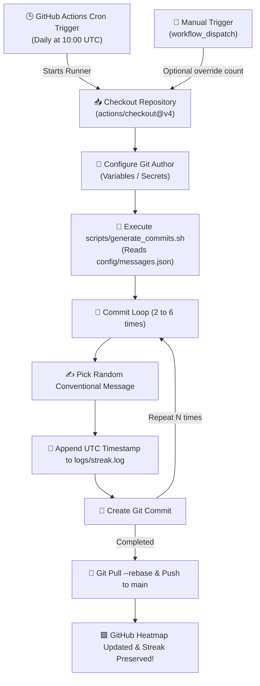

<div align="center">

# 🔥 Streak Keeper

### **Automated GitHub Activity & Contribution Streak Engine**

[](https://github.com/MahmoudEsawi/streak-keeper/actions/workflows/streak.yml)
[](https://github.com/MahmoudEsawi/streak-keeper/actions/workflows/ci.yml)
[](https://conventionalcommits.org)
[](LICENSE)
[](https://github.com/MahmoudEsawi)
[](CONTRIBUTING.md)
[](https://github.com/features/actions)

<p align="center">
  <b>A lightweight, zero-maintenance, open-source GitHub Actions engine engineered to keep your GitHub contribution heatmap consistently active with authentic conventional commits.</b>
</p>

[Overview](#-what-is-streak-keeper) •
[Architecture](#%EF%B8%8F-clean-architecture--folder-structure) •
[Features](#-features) •
[How It Works](#-how-it-works) •
[Quick Setup](#-quick-setup-guide) •
[Documentation](#-documentation) •
[License](#-license)

---

</div>

## 📖 What is Streak Keeper?

**`streak-keeper`** is an automated **GitHub Activity & Contribution Streak Engine**. 

GitHub visually tracks your daily developer activity through the **"Green Contribution Graph"**. Days without pushed commits leave blank gaps in your activity history and reset your streak counters. 

This repository solves that by using **GitHub Actions (Cron-scheduled CI/CD pipelines)** to automatically generate regular, realistic conventional commits into this repository every day—ensuring your streak stays unbroken and your profile displays consistent daily momentum.

### 💡 Core Value
- 保持 **Unbroken GitHub Streaks**: Keep your activity streak counter growing continuously without manual daily intervention.
- 🕒 **100% Serverless & Free**: Runs purely on GitHub Actions runners (0 external servers, VPS, or hosting costs).
- 🎯 **Realistic Git History**: Dispatches conventional commits (`feat`, `fix`, `docs`, `refactor`, `perf`, `ci`, `chore`) with realistic commit volume variance (2–6 commits/day).
- 🛡️ **Zero Contamination**: Commits are strictly isolated to this repository's audit log ([`logs/streak.log`](logs/streak.log)), keeping your real production repositories clean.
- 🏗️ **Clean Architecture**: Modular shell scripts, structured JSON configurations, CI checks, and open-source compliance files.

---

## 🏗️ Clean Architecture & Folder Structure

The repository is structured following clean architectural principles, separating CI/CD orchestration, configuration, executable scripts, documentation, and logs:

```text
streak-keeper/
├── .github/
│   ├── ISSUE_TEMPLATE/          # GitHub issue intake forms
│   │   ├── bug_report.yml       # Bug report template
│   │   ├── feature_request.yml  # Feature proposal template
│   │   └── config.yml           # Issue template configuration
│   ├── workflows/               # CI/CD Automation pipelines
│   │   ├── streak.yml           # Daily scheduled commit generator
│   │   └── ci.yml               # Automated CI linting and test validation
│   ├── labels.yml               # Repository labels specification
│   ├── PULL_REQUEST_TEMPLATE.md # Standard PR review checklist
│   └── dependabot.yml           # Automated action dependency updates
├── config/
│   └── messages.json            # Categorized pool of conventional commit messages
├── docs/
│   ├── ARCHITECTURE.md          # System architecture and data flow design
│   └── SETUP.md                 # Detailed setup & local troubleshooting guide
├── logs/
│   ├── streak.log               # Live activity audit log
│   ├── activity.log             # Archived history
│   └── .gitkeep                 # Git directory anchor
├── scripts/
│   └── generate_commits.sh      # Modular generator engine with CLI options
├── .editorconfig                # Universal IDE formatting standards
├── .gitignore                   # Version control ignore rules
├── CODE_OF_CONDUCT.md           # Community standards (Contributor Covenant 2.1)
├── CONTRIBUTING.md              # Open source contribution guidelines
├── LICENSE                      # MIT Open Source License
├── README.md                    # Main project overview & documentation
└── SECURITY.md                  # Security vulnerability disclosure policy
```

---

## ✨ Features

- ⏰ **Scheduled Autonomous Triggers**: Runs automatically every day at `10:00 UTC` via GitHub Actions cron.
- 🎲 **Stochastic Commit Volume**: Randomizes commit count between **2 and 6 commits daily** to emulate human development flow.
- ✍️ **Conventional Commits Standard**: Employs semantic messages across 10 categories (`feat`, `fix`, `docs`, `refactor`, `perf`, `style`, `test`, `chore`, `ci`, `build`).
- 🔘 **Manual Workflow Dispatch**: Trigger instant streak updates on-demand anytime with an optional manual commit count override.
- 📊 **Rich Run Summaries**: Automatically posts formatted Markdown tables to `$GITHUB_STEP_SUMMARY` in GitHub Actions.
- 🔄 **Safe Concurrency & Auto-Rebase**: Built-in `git pull --rebase` prevents push conflicts and handles branch sync automatically.
- 🧪 **CI Test Suite**: Automated linting (`shellcheck`) and JSON config validation on every pull request.
- 💻 **Local Dry-Run Support**: Test the generator locally anytime without making actual commits (`bash scripts/generate_commits.sh --dry-run`).

---

## ⚙️ How It Works



---

## 🚀 Quick Setup Guide

Get your automated streak keeper running in 4 easy steps:

### 1. Fork or Clone this Repository
Fork this repository to your GitHub account or clone it directly:
```bash
git clone https://github.com/MahmoudEsawi/streak-keeper.git
cd streak-keeper
```

### 2. Enable GitHub Actions Workflow Permissions
GitHub Actions needs permission to push commits to your repository:
1. Navigate to **Settings** > **Actions** > **General** in your repository.
2. Scroll down to **Workflow permissions**.
3. Select **Read and write permissions**.
4. Click **Save**.

```
Repository Settings
 └── Actions
      └── General
           └── Workflow permissions
                └── 🔘 Read and write permissions [SAVE]
```

### 3. Configure Author Identity *(Optional but Recommended)*
To ensure commits are credited to your GitHub account and counted on your profile graph:
- Go to **Settings** > **Secrets and variables** > **Actions** > **Variables**.
- Add:
  - `GIT_USER_NAME`: Your GitHub Full Name (e.g. `Mahmoud Al-Esawi`)
  - `GIT_USER_EMAIL`: Your GitHub Account Email (e.g. `your-email@example.com`)

### 4. Test the Automation
1. Navigate to the **Actions** tab on your GitHub repository.
2. Under **All workflows**, select **⚡ Auto Streak Updater**.
3. Click **Run workflow** > Select `main` branch > Click **Run workflow**.
4. Check your GitHub profile contribution graph—your green activity squares will update immediately!

---

## 💻 Local CLI Usage

You can run and test the commit generator script directly on your terminal:

```bash
# Show CLI options
bash scripts/generate_commits.sh --help

# Run a dry-run (simulation without commits)
bash scripts/generate_commits.sh --dry-run --count 3

# Generate exact commit count with custom author
bash scripts/generate_commits.sh --count 4 \
  --author-name "Developer Name" \
  --author-email "dev@example.com"
```

---

## 📚 Documentation

| Document | Purpose |
| :--- | :--- |
| [ARCHITECTURE.md](docs/ARCHITECTURE.md) | In-depth breakdown of system design, error recovery, and data flows |
| [SETUP.md](docs/SETUP.md) | Detailed installation, testing, and troubleshooting guide |
| [CONTRIBUTING.md](CONTRIBUTING.md) | Guidelines for contributing code, messages, and workflows |
| [CODE_OF_CONDUCT.md](CODE_OF_CONDUCT.md) | Contributor Covenant 2.1 community standard |
| [SECURITY.md](SECURITY.md) | Security vulnerability disclosure procedure |
| [LICENSE](LICENSE) | MIT Open Source License terms |

---

## 🏷️ Repository Metadata & Topics

Use these recommended metadata attributes in your GitHub repository settings (**About** section):

### 📌 Description
```text
⚡ Automated GitHub contribution streak & activity graph generator powered by GitHub Actions with realistic conventional commits.
```

### 🏷️ Topics / Tags
```text
github-streak, contribution-graph, green-graph, github-actions, automation, cron-job, streak-keeper, git-streak, profile-enhancement, conventional-commits
```

---

## 🤖 CI/CD Automation & Label System

This repository includes a standardized labeling system configured in [`.github/labels.yml`](.github/labels.yml):

| Label | Color | Description |
| :--- | :---: | :--- |
| `🤖 automation` | `0E8A16` | Automated streak updates, cron jobs, and bot maintenance |
| `🚀 ci/cd` | `1D76DB` | GitHub Actions workflow configurations and pipeline triggers |
| `🔥 streak-keeper` | `2EA44F` | Contribution graph activity and streak generation logic |
| `📖 documentation`| `0075CA` | Improvements, additions, or updates to documentation and README |
| `✨ enhancement` | `A2EEEF` | New features, options, or enhancements |
| `🧹 maintenance` | `FBCA04` | Routine repository cleanups, log rotations, and dependency updates |
| `🐛 bug` | `D73A4A` | Bug reports and script fixes |

---

## 📜 Activity Log Inspection

Each workflow run appends structured timestamped entries to [`logs/streak.log`](logs/streak.log):

```log
[2026-08-31T10:00:15Z] Streak update #1: feat(api): add error handling middleware
[2026-08-31T10:00:16Z] Streak update #2: fix(ui): responsive layout adjustments for navbar
[2026-08-31T10:00:17Z] Streak update #3: docs: update setup instructions in README.md
```

---

## 🛡️ Disclaimer & Best Practices

> [!NOTE]
> This project is designed for developer profile customization, streak preservation, and exploring GitHub Actions automation. While a vibrant green contribution graph looks aesthetically pleasing, genuine learning, open-source collaboration, and real project code remain the true markers of great engineering! 🚀

---

## 📄 License

Distributed under the **MIT License**. See [`LICENSE`](LICENSE) for more information.

---

<div align="center">

Crafted with 💚 by **[Mahmoud Al-Esawi](https://github.com/MahmoudEsawi)**

⭐ *If you find this project helpful, consider starring the repository!*

</div>
